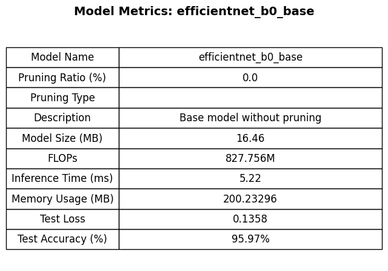
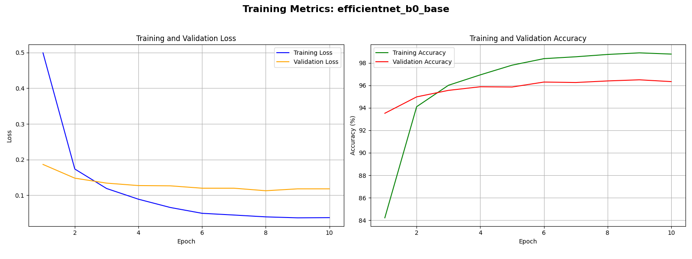
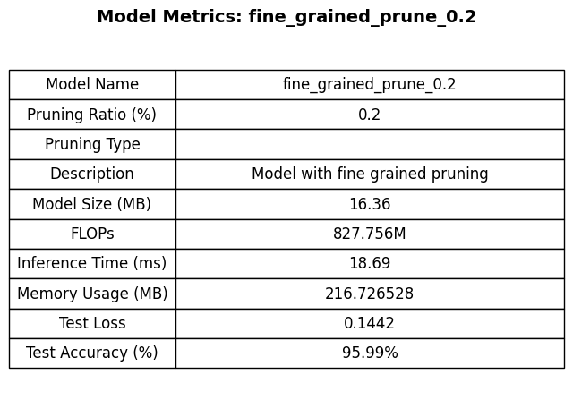
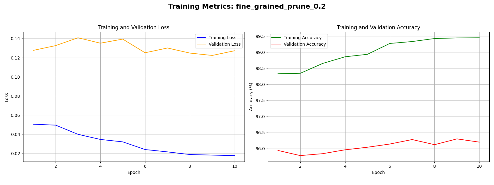
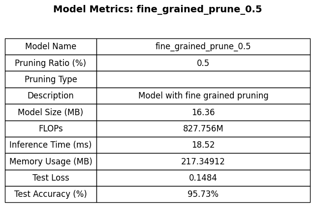
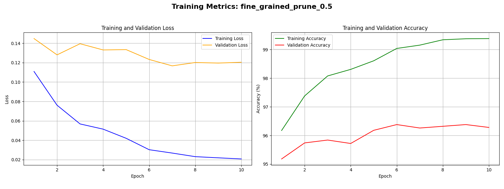
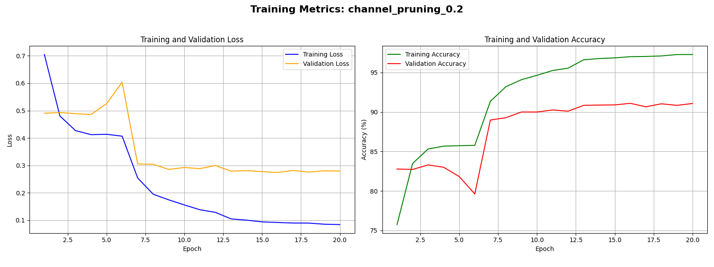
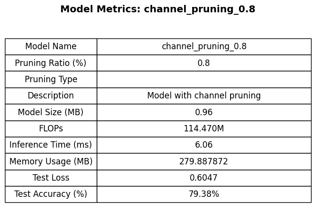
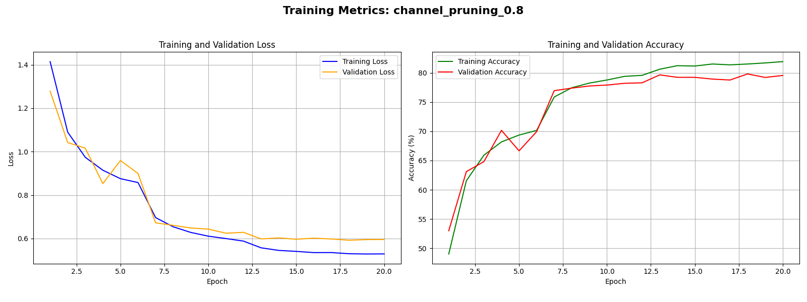

# Deep Learning Model Sparsification for Efficient Inference

Chanaka Perera

---

## Introduction

This project explores how to prune a deep learning model. Model training and evaluation were conducted on a CUDA-enabled device to speed up training. Additionally, for faster experimentation, I decided to use a lightweight model adapted to a smaller dataset as the base model for pruning. For this experiment, I used a pretrained EfficientNet-B0 model available in the PyTorch modules trained on ImageNet and adapted it to the CIFAR-10 dataset. This allows us to use the weights and rich feature interpretation that the model has learned on ImageNet off the bat and we can do minimal fine tuning on the CIFAR-10 dataset to create an accurate base model for further pruning.

---

## Folder Structure

The project is organized as:

- **`channel_pruning.ipynb`**: This notebook contains the implementation of channel-level pruning applied to the EfficientNet-B0 model. It details the methodology, code, and results associated with pruning entire channels to enhance model efficiency.

- **`efficient_net_cifar_10.ipynb`**: Dedicated to the fine-tuning of the EfficientNet-B0 model on the CIFAR-10 dataset, this notebook covers the training process, hyperparameter settings, and evaluation metrics used to adapt the pretrained model to the new dataset.

- **`fine_grained_pruning.ipynb`**: This notebook focuses on fine-grained pruning techniques, detailing how individual weights within the model are pruned based on their importance. It includes the implementation steps, code snippets, and analysis of the effects of fine-grained pruning on model performance.

In addition to the notebooks, the project directory contains the following subfolders:

- **`models/`**: This directory stores the saved versions of the trained EfficientNet-B0 models before any pruning is applied. It serves as a repository for baseline models that can be referenced or restored as needed.

- **`pruned_models/`**: Housing the models after pruning has been performed, this folder allows for easy access to the optimized models. It enables comparison between the original and pruned versions to assess the impact of pruning techniques.

- **`metrics_plots/`**: This folder contains images and visualizations of the various metrics obtained from the pruning experiments. These plots provide a visual representation of model size, FLOPs, accuracy, and other relevant metrics, aiding in the analysis and interpretation of the pruning results.

## EfficientNet-B0

**EfficientNet-B0** is a model that can be loaded easily by using PyTorch, trained on the ImageNet dataset. This model builds on traditional convolutional neural networks (CNNs) by enhancing performance and efficiency. Traditional CNNs scale by increasing depth (number of layers), width (number of channels), or resolution (input image size). However, this approach may lead to poor improvements in accuracy relative to the increased computational cost. EfficientNet uses a set of predefined scaling coefficients to scale all dimensions in a balanced manner. By proportionally increasing all dimensions, this model maintains feature representations well without too much computational overhead.

### Key Features of EfficientNet-B0

1. **Balanced Scaling:** EfficientNet scales depth, width, and resolution uniformly using compound scaling.
2. **Depthwise Separable Convolutions:** Reduces computational cost compared to standard convolutions.
3. **Squeeze-and-Excitation (SE) Modules:** Enhances feature representations by modeling interdependencies between channels.

### Depthwise and Pointwise Convolutions

EfficientNet consists of two primary operations:

1. **Depthwise Convolutions:**
   - **Function:** Applies a single filter per input channel.
   - **Benefit:** Reduces computational overhead compared to traditional CNNs that apply filters across all input channels simultaneously.
   - **Example:**
     - **Input:** 3 channels (R, G, B)
     - **Filters:** 3 separate 3x3 filters (one for each channel)
     - **Output:** 3 feature maps

2. **Pointwise Convolutions:**
   - **Function:** Combines filtered outputs to the desired number of output channels.
   - **Benefit:** Allows the model to learn information across different channels.
   - **Example:**
     - **Input:** 3 feature maps from depthwise convolution
     - **Filters:** 32 separate 1x1 filters
     - **Output:** 32 feature maps

### Squeeze-and-Excitation (SE) Modules

SE modules come after pointwise convolutions to prioritize more important features.

- **Squeeze Operation:**
  - **Function:** Global Information Aggregation by computing a single summary statistic (e.g., global average pooling) for each feature map (channel).
  - **Output:** A vector representing the importance of each channel.

- **Excitation Operation:**
  - **Function:** Generates adaptive weights for each channel by passing the squeezed vector through a small neural network (usually two fully connected layers with a non-linear activation in between).
  - **Output:** Scaled feature maps where each feature map is multiplied by its corresponding weight, enhancing important features and diminishing less relevant ones.

### Network Architecture Search

EfficientNet employs an **automated search method** for identifying the best configuration by exploring different search spaces. It uses algorithms such as reinforcement learning to find an effective configuration that maximizes performance while minimizing computational cost. This approach helps identify architectural patterns that are not as intuitive to humans.

### Dataset: CIFAR-10

- **CIFAR-10 Images:** Each image is 32x32 with RGB color channels.
- **Total Classification Classes:** 10 categories
- **Training Set:** 50,000 images
- **Test Set:** 10,000 images

---

## Training and Fine-Tuning a Base Model

```python
def get_data_loaders(dataset_name='CIFAR10', data_dir='./data', batch_size=128, num_workers=8, pin_memory=True, valid_split=0.1, seed=42):
    """
    Create and return DataLoaders for training, validation, and testing.
    
    Args:
        dataset_name (str): Name of the dataset ('CIFAR10', 'ImageNet', etc.).
        data_dir (str): Directory where data is stored/downloaded.
        batch_size (int): Number of samples per batch.
        num_workers (int): Number of subprocesses to use for data loading.
        pin_memory (bool): If True, the data loader will copy Tensors into CUDA pinned memory before returning them.
        valid_split (float): Fraction of training data to use for validation.
        seed (int): Random seed for reproducibility.
    
    Returns:
        tuple: (train_loader, val_loader, test_loader)
    """
    # Define transforms
    transform_train = transforms.Compose([
        transforms.Resize(224),
        transforms.RandomHorizontalFlip(),
        transforms.ToTensor(),
        transforms.Normalize(mean=[0.485, 0.456, 0.406], 
                             std =[0.229, 0.224, 0.225]),
    ])
    
    transform_val = transforms.Compose([
        transforms.Resize(224),
        transforms.ToTensor(),
        transforms.Normalize(mean=[0.485, 0.456, 0.406],
                             std =[0.229, 0.224, 0.225]),
    ])    
    # Load datasets
    if dataset_name == 'CIFAR10':
        full_train_dataset = torchvision.datasets.CIFAR10(root=data_dir, train=True,
                                                           download=True, transform=transform_train)
        
        test_dataset = torchvision.datasets.CIFAR10(root=data_dir, train=False,
                                                    download=True, transform=transform_val)
    elif dataset_name == 'ImageNet':
        full_train_dataset = torchvision.datasets.ImageNet(root=data_dir, split='train',
                                                           download=False, transform=transform_train)
        
        test_dataset = torchvision.datasets.ImageNet(root=data_dir, split='val',
                                                    download=False, transform=transform_val)
    else:
        raise ValueError(f"Dataset '{dataset_name}' not supported.")    
    # Split training into train and validation
    train_size = int((1 - valid_split) * len(full_train_dataset))
    val_size = len(full_train_dataset) - train_size
    train_dataset, val_dataset = random_split(full_train_dataset, [train_size, val_size],
                                            generator=torch.Generator().manual_seed(seed)) 
    
    # Create DataLoaders
    train_loader = DataLoader(train_dataset, batch_size=batch_size,
                              shuffle=True, num_workers=num_workers, pin_memory=pin_memory)
    val_loader = DataLoader(val_dataset, batch_size=batch_size,
                            shuffle=False, num_workers=num_workers, pin_memory=pin_memory)
    test_loader = DataLoader(test_dataset, batch_size=batch_size,
                             shuffle=False, num_workers=num_workers, pin_memory=pin_memory)
    
    return train_loader, val_loader, test_loader
```

### Transformations

Our input dataset needs to be transformed to match the input layer of efficientNet. Since efficientNet was trained on 224x244 images.
The network expects images  of the same dimensions unless we replace the input layer. We will then need to modify all subsequent layers
which can degrade the performance of our pre-trained model that already has learned a lot of rich feature representations. In addition
we perform some simple data augmentation such as horizontal flips so the model is better generalized. We finally convert the data to a
tensor so we can move the data to the GPU/TPU. Also the values across input channels are normalized based on ImageNet coefficients.

### DataLoaders

Since we will need to load the data for fine tuning after pruning as well as to test the final models'
accuracy we can define a common function to load the needed data loaders for the test set, the validation set as well as
the train set. We can use Pytorch here as it has inbuilt functionality that  allows us to  load our data onto the GPU
in batches. In our case we take samples of 128 images. The GPU performs batch processing. This means that the gradients
are updated for a set of 128 images that are loaded onto the GPU memory. We also shuffle the data to prevent any orders and
prevent the network from learning any specific patterns for the data. Pin memory ensures faster data transfer to the GPU.
These inbuilt optimizations help to speed up the fine tuning process with minimal code.

## Loss function, optimizer and learning rate scheduler

### Cross-Entropy Loss

It measures the difference between the predicted probabilities of each class and the true class labels:

- For each input, the model outputs a set of scores (logits) for each class.
- These logits are passed through a softmax function to convert them into probabilities.
- The cross-entropy loss calculates how far these probabilities are from the true class (encoded as a one-hot vector).
- The goal is to minimize this loss so that the predicted probabilities align closely with the true labels.
- For example, if the true class is "cat" (encoded as [1, 0, 0]) and the model predicts probabilities [0.7, 0.2, 0.1], the cross-entropy loss will measure how well the predicted distribution matches the true class.

### Optimizer (Stochastic Gradient Descent - SGD)

The optimizer updates the model's parameters during training using gradient descent. The key components here are:

- filter(lambda p: p.requires_grad, model.parameters()): We only update the parameters of the layers that are unfrozen.Helps to avoid overfitting.
- Learning Rate (lr=0.01): Determines the step size for each parameter update. A small learning rate makes convergence stable but slow, while a large learning rate can lead to overshooting or instability.
- Momentum (momentum=0.9): Adds a fraction of the previous update's direction to the current one, helping to overcome local minima and speeding up convergence.
- Weight Decay (weight_decay=5e-4): This adds L2 regularization, which discourages overly large weights and helps prevent overfitting.
- SGD computes gradients using backpropagation and updates the weights to minimize the loss.

### Learning Rate Scheduler

A learning rate scheduler adjusts the learning rate during training. This is important because:

- A high learning rate can make the model converge faster at the start, but it might not find the optimal solution.
- A low learning rate later in training helps fine-tune the model for better accuracy.
- The StepLR scheduler decreases the learning rate by a factor of gamma every step_size epochs:
step_size=5: Reduces the learning rate every 5 epochs.
gamma=0.1: Multiplies the current learning rate by 0.1. 
This means at epoch 6 during fine tuning our learning rate will be 0.01 if our initial learning rate is 0.1

## Fine-tuning the model

The final classification layer of the pre-trained model is replaced to match the 10 classes in the CIFAR-10 dataset. Since the early
layers contain more basic feature representations such as shapes learned on ImageNet, before finetuning which I want to preservem, I froze the layers closer to the input and only updated the gradients of layers closer to the output layer.

This technique was effective as the model could be fine-tuned with a few epochs for very high accuracy on the test set. Finally I saved
the model as a state dictionary. Pytorch gives you the option of saving the model in one of two ways. Either as the entire model or as
a state dictionary which contains the trained parameters. A storage efficient way to store a model is to store it as a state dictionary
rather than the model. We can then redefine the model in another module and load the model once more.

``` bash
--- Epoch 1 ---
Train Loss: 0.4990 | Train Acc: 84.21% | Time: 59.17s
Val Loss: 0.1865 | Val Acc: 93.52%
Best model saved with Val Acc: 93.52%

--- Epoch 2 ---
Train Loss: 0.1736 | Train Acc: 94.10% | Time: 57.07s
Val Loss: 0.1480 | Val Acc: 94.98%
Best model saved with Val Acc: 94.98%

--- Epoch 3 ---
Train Loss: 0.1189 | Train Acc: 96.01% | Time: 57.18s
Val Loss: 0.1340 | Val Acc: 95.56%
Best model saved with Val Acc: 95.56%

--- Epoch 4 ---
Train Loss: 0.0890 | Train Acc: 96.94% | Time: 57.12s
Val Loss: 0.1272 | Val Acc: 95.88%
Best model saved with Val Acc: 95.88%

--- Epoch 5 ---
Train Loss: 0.0658 | Train Acc: 97.80% | Time: 57.01s
Val Loss: 0.1265 | Val Acc: 95.86%
No improvement this epoch.
...
Train Loss: 0.0374 | Train Acc: 98.79% | Time: 56.96s
Val Loss: 0.1180 | Val Acc: 96.34%
No improvement this epoch.
```

As you can see the model started with a very high validation accuracy off the bat due to the pre-trained weights.

## Metrics

After fine-tuning, I created a set of metrics to evaluate various aspects of the model's performance and efficiency. These metrics are implemented in `metrics.py` and provide comprehensive insights into the model's characteristics and behavior during inference and evaluation. Below is an explanation of each metric and how the corresponding code computes it.

### Model Size

**Model Size** refers to the amount of memory required to store the model's parameters. This metric is crucial for understanding the storage and deployment requirements of the model. In the code, the `get_model_size` function saves the model's state dictionary to a temporary file and calculates its size in megabytes (MB) using the file system's `getsize` method. After obtaining the size, the temporary file is removed to ensure no residual data is left on the disk. This approach provides an accurate measurement of the model's storage footprint without affecting the original model.

### Inference Time

**Inference Time** measures the average time the model takes to process a single input during the forward pass. This metric is essential for assessing the model's efficiency and suitability for real-time applications. The `measure_inference_time` function performs multiple forward passes (default is 100 iterations) on randomly generated input data of a specified size. It records the start and end times surrounding the inference loop, ensuring synchronization for CUDA devices to obtain precise timing. The average time per inference is then calculated and returned in milliseconds, providing a clear indication of the model's responsiveness.

### FLOPs (Floating Point Operations)

**FLOPs** quantify the computational complexity of the model by counting the number of floating-point operations required for a single forward pass. This metric helps in understanding the model's efficiency and scalability, especially when deploying on resource-constrained environments. The `compute_flops` function utilizes the `profile` method from the `torchprofile` library to estimate the number of multiply-accumulate operations (MACs) and parameters. It then approximates FLOPs by doubling the MACs, a common estimation practice. The result is formatted for readability, offering a straightforward measure of the model's computational demands.

### Memory Usage

**Memory Usage** captures the peak memory consumption of the model during a forward pass, which is vital for ensuring that the model fits within the available hardware resources. The `get_memory_usage` function specifically targets CUDA-enabled devices to monitor GPU memory usage. It generates a random input tensor and resets the peak memory statistics before performing a forward pass. After the inference, it retrieves the maximum memory allocated during the operation and converts it to megabytes (MB). If the model is not running on a CUDA device, the function gracefully returns "N/A," indicating that memory usage monitoring is not available for that setup.

### Test Loss and Test Accuracy

**Test Loss** and **Test Accuracy** are fundamental metrics for evaluating the model's performance on unseen data. The `evaluate_model` function assesses these metrics by running the model in evaluation mode on the test dataset. It calculates the loss using a specified criterion (e.g., cross-entropy loss) and determines the accuracy by comparing the model's predictions against the true labels. The function iterates through the test data loader, aggregating the loss and counting correct predictions to compute the average loss and overall accuracy percentage. These metrics provide a clear indication of the model's generalization capabilities and effectiveness in classification tasks.

## Results of base fine tuned model

After fine tuning for 10 epochs I was able to get a final model with a  95.97% accuracy on the 1000 sample test set that was isolated
from both testing and validation. While the validation set is never used to update our gradients and might be sufficient, it is the
factor that we use to choose our best model adding bias. Therefore the final model accuracy performed on the same test set as the
pruned models is a better measure of accuracy.



*Figure 1: Metrics table for the fine tuned base model



*Figure 1: Fine tuning results for the fine tuned base model

## Pruning

Pruning is a critical technique in optimizing deep learning models by reducing their size and computational requirements without significantly compromising performance. By systematically removing redundant or less important components of the network, pruning enables the deployment of efficient models on resource-constrained devices and accelerates inference times. Various pruning methods exist, each targeting different aspects of the model's architecture and offering unique advantages. Below is an overview of the primary pruning methods utilized in model sparsification.

### Fine-Grained Pruning

**Fine-grained pruning** involves removing individual weights from the neural network based on specific criteria, such as their magnitude. This method operates at the level of individual connections between neurons, allowing for high levels of sparsity within the model. By targeting the least significant weights, fine-grained pruning effectively reduces the number of parameters, leading to a smaller model size. However, since the sparsity introduced is unstructured, it may not directly translate to faster inference times on standard hardware without specialized libraries that can exploit such sparsity. Fine-grained pruning is ideal for scenarios where memory reduction is a priority, and computational resources are managed by advanced optimization techniques.

### Pattern-Based Pruning

**Pattern-based pruning** introduces a structured approach by removing groups of weights following specific patterns within the network layers. Unlike fine-grained pruning, which targets individual weights, pattern-based pruning removes weights in predefined configurations (e.g., blocks or stripes). This method maintains a level of regularity in the sparsity pattern, making it more hardware-friendly and easier to optimize for acceleration. By adhering to consistent patterns, pattern-based pruning strikes a balance between achieving sparsity and maintaining computational efficiency. This approach is particularly beneficial for models deployed on hardware that can exploit regular sparsity patterns for enhanced performance.

### Channel Pruning

**Channel pruning** focuses on eliminating entire channels (also known as feature maps) within convolutional layers. By removing these channels, the method reduces both the number of parameters and the computational load of subsequent layers that depend on these channels. Channel pruning leads to structured sparsity, which is more amenable to hardware acceleration compared to unstructured methods. This results in models that are not only smaller but also faster during inference, making channel pruning a popular choice for deploying models on devices with limited computational resources. Additionally, channel pruning can enhance the interpretability of the model by simplifying its architecture without significantly affecting its predictive capabilities.

### Kernel Pruning

**Kernel pruning** involves removing specific convolutional kernels (filters) within a layer. Unlike channel pruning, which removes all kernels associated with a particular channel, kernel pruning targets individual kernels based on their importance. This allows for a more granular reduction in the model's complexity while preserving some channels entirely. By selectively pruning kernels, this method can achieve significant reductions in computation and memory usage without uniformly decreasing the number of channels. Kernel pruning introduces structured sparsity, similar to channel pruning, but with finer control over which parts of the network are reduced. This makes it a versatile approach for optimizing models where selective feature extraction is essential.

### Vector Level Pruning

**Vector level pruning** targets entire vectors within the network, such as those in fully connected layers. By removing these vectors, the method reduces the dimensionality of the weight matrices, leading to decreased memory usage and faster computations. Vector level pruning maintains a structured form of sparsity, akin to channel and kernel pruning, making it suitable for models where fully connected layers constitute a significant portion of the parameters. This method is particularly effective in scenarios where the network's capacity can be reduced without adversely affecting its performance on the task. By eliminating entire vectors, vector level pruning simplifies the network architecture and enhances computational efficiency.

### Structured vs. Unstructured Pruning

Pruning techniques can be broadly categorized into **structured** and **unstructured** pruning. **Structured pruning** removes entire components of the network, such as channels, kernels, or vectors, resulting in models with regular and predictable sparsity patterns. This form of pruning is generally more compatible with existing hardware accelerators, allowing for straightforward optimizations and speedups during inference. On the other hand, **unstructured pruning** removes individual weights without regard to their arrangement within the network, leading to highly sparse and irregular weight matrices. While unstructured pruning can achieve higher levels of sparsity, it often requires specialized software and hardware support to realize practical speedups, as standard hardware is typically optimized for dense computations. Understanding the distinction between these categories is crucial for selecting the appropriate pruning method based on the desired balance between model sparsity, computational efficiency, and hardware compatibility.

### Relationship Between Pruning Methods

The pruning methods discussed above can be viewed as subtypes within the broader categories of structured and unstructured pruning. **Fine-grained pruning** and **pattern-based pruning** typically fall under the **unstructured** category due to their focus on individual weights or specific patterns without maintaining overall structural integrity. In contrast, **channel pruning**, **kernel pruning**, and **vector level pruning** are examples of **structured** pruning, as they remove entire components of the network in a systematic and hardware-friendly manner. This classification helps in selecting the most suitable pruning strategy based on the deployment requirements and the nature of the target hardware.

### Distinguishing Channel and Kernel Pruning

While both **channel pruning** and **kernel pruning** are structured pruning techniques aimed at reducing the model's complexity, they differ in their granularity and scope. **Channel pruning** removes entire channels or feature maps from convolutional layers, effectively eliminating all kernels associated with a particular channel across the network. This results in a uniform reduction in the number of channels, simplifying the network architecture and ensuring consistent reductions in computational load. In contrast, **kernel pruning** targets individual kernels within a convolutional layer, allowing for more selective and granular removal of filters. Unlike channel pruning, which affects all kernels linked to a channel, kernel pruning can remove specific kernels based on their importance, enabling finer control over the pruning process. This distinction allows practitioners to choose between broader reductions (channel pruning) and more nuanced optimizations (kernel pruning) depending on their specific requirements and constraints.

For this project I have implemented structured pruning using **fine-grained pruning** and unstructured pruning through **channel pruning**.

## Implementing Fine-Grained Pruning

### Implementation

``` python
# Function to apply pruning to all Conv2d and Linear layers
def apply_fine_grained_pruning(model, method='l1_unstructured', amount=0.2):
    parameters_to_prune = []
    for name, module in model.named_modules():
        if isinstance(module, nn.Conv2d) or isinstance(module, nn.Linear):
            parameters_to_prune.append((module, 'weight'))
    
    # Apply pruning
    prune.global_unstructured(
        parameters_to_prune,
        pruning_method=prune.L1Unstructured if method == 'l1_unstructured' else prune.RandomUnstructured,
        amount=amount,
    )
    print(f"Applied {method} pruning with amount={amount*100}%.")
    return model

# Function to make pruning permanent
def remove_pruning(model):
    for name, module in model.named_modules():
        if isinstance(module, nn.Conv2d) or isinstance(module, nn.Linear):
            try:
                prune.remove(module, 'weight')
                print(f"Removed pruning reparameterization from {name}.")
            except ValueError:
                print(f"No pruning to remove for {name}.")
    return model
```

## Fine-Grained Pruning Implementation

To optimize the EfficientNet-B0 model adapted for the CIFAR-10 dataset, I implemented **fine-grained pruning** using PyTorch's pruning utilities. The `apply_fine_grained_pruning` function targets all convolutional (`Conv2d`) and fully connected (`Linear`) layers within the model. It does this by iterating through each layer and collecting their weight parameters that are eligible for pruning. The pruning process is executed globally across these layers, meaning that the smallest weights across the entire network are identified and zeroed out, rather than doing so on a per-layer basis. Specifically, **L1 unstructured pruning** is applied, which removes individual weights based on their absolute values. In this case, 20% of the lowest-magnitude weights are set to zero, effectively reducing the number of active connections in the network. This method does not follow any specific pattern, allowing for a high degree of sparsity and flexibility in how the weights are pruned.

The benefit of this approach is twofold. First, by removing the least significant weights, the model becomes smaller and requires less memory, which is crucial for deployment on devices with limited resources. Second, the reduction in active weights can lead to faster inference times, as there are fewer computations needed during the forward pass. However, because the pruning is unstructured (random individual weights are removed), specialized libraries or hardware optimizations are often required to fully leverage the sparsity for performance gains.

After pruning, it's important to make the changes permanent to ensure that the pruned weights remain zeroed out during future training or deployment. The `remove_pruning` function achieves this by removing the pruning reparameterization applied by PyTorch. Pruning in PyTorch temporarily masks the weights by adding a pruning mask, which is why simply applying pruning does not permanently alter the model's weights. By calling `prune.remove` on each pruned layer, the function consolidates the pruned weights, effectively making the sparsity a permanent part of the model's architecture. This step is crucial to prevent the pruned weights from being updated during further training, ensuring that the model remains efficient and maintains its reduced size and computational requirements.

Overall, fine-grained pruning using L1 unstructured methods provides a straightforward way to reduce model complexity by zeroing out the least important weights across all targeted layers. This results in a more compact and potentially faster model without a significant loss in accuracy, making it an effective strategy for deploying deep learning models in resource-constrained environments.

### Pruning results

I took the base finetuned model and applied fine-grained pruning with different ratios. I then finetuned these models over a few epochs to recover any lost performance. The metrics for these experiment were collected for different pruning ratios is as follow:

0.2:


*Figure 3: Metrics table



*Figure 4: Fine tuning result

0.5:


*Figure 5: Metrics table



*Figure 6: Fine tuning result

### Pruning Results Analysis

Despite implementing fine-grained pruning with sparsity levels of 20% and 50%, the observed metrics—**model size**, **FLOPs**, and **memory usage**—did not exhibit significant changes. This outcome might initially seem counterintuitive, given that pruning is intended to reduce the model's complexity and resource requirements. However, several factors inherent to the pruning methodology and its implementation in PyTorch contribute to this result.

#### Understanding Unstructured Pruning Limitations

The pruning technique employed in this experiment is **L1 unstructured pruning**, which zeros out individual weights based on their magnitude without altering the overall architecture of the model. While this method effectively increases sparsity by setting less important weights to zero, it does not remove these weights from the model's structure. Consequently, the total number of parameters remains unchanged, which is why the **model size** does not decrease. The weights are still stored in the same tensor format, with zero values occupying the same memory space as non-zero weights.

#### Impact on FLOPs and Memory Usage

Similarly, **FLOPs (Floating Point Operations)** and **memory usage** metrics remain unaffected because the underlying computation graph and tensor dimensions are preserved. Unstructured pruning does not modify the connectivity or the number of operations required during the forward and backward passes. As a result, the computational complexity remains the same, and standard hardware cannot inherently take advantage of the introduced sparsity to optimize performance. Without specialized libraries or hardware optimizations that recognize and efficiently handle sparse matrices, the theoretical reductions in FLOPs do not translate into practical speedups or memory savings.

#### Making Pruning Permanent and Effective

Another critical aspect is the permanence of pruning. Although the `remove_pruning` function is used to make the pruning permanent by removing the pruning reparameterization, it primarily consolidates the pruning mask with the model's weights. This step ensures that the zeroed weights remain fixed during further training or deployment. However, to achieve actual reductions in model size and memory usage, additional steps are necessary. For instance, one would need to restructure the model to exclude the pruned weights entirely or utilize sparse data structures that inherently support reduced storage requirements.

### Conclusion

In summary, its' very easy to implement fine-grained pruning and achieve good accuracy. However, it is hard to translate those sparsity
benefits to computational improvements without the proper hardware or further processing.

## Implementing Channel-level pruning

``` python
def apply_channel_pruning(model, pruning_ratio=0.2):
    """
    Applies channel-level pruning to the given model using L1-norm based importance.

    Args:
        model (nn.Module): The PyTorch model to prune.
        pruning_ratio (float): The fraction of channels to prune globally (e.g., 0.2 for 20%).

    Returns:
        nn.Module: The pruned model.
    """
    # Set model to evaluation mode
    model.eval()  
    # Create a dummy input tensor matching the input shape expected by the model
    dummy_input = torch.randn(1, 3, 224, 224).to(next(model.parameters()).device)  
    # Define the importance metric: L1 norm
    importance = tp.importance.MagnitudeImportance(p=1) 
    # Identify layers to ignore during pruning (e.g., final classifier layer)
    ignored_layers = []
    for m in model.modules():
        # Avoid the final classifier layer
        if isinstance(m, nn.Linear) and m.out_features == 10:
            ignored_layers.append(m)  
    # Initialize the MetaPruner with the desired settings
    pruner = tp.pruner.MetaPruner(
        model=model,
        example_inputs=dummy_input,
        importance=importance,
        pruning_ratio=pruning_ratio,  
        ignored_layers=ignored_layers,
        #For hardware acceleration
        round_to=8,  
    )
    # Perform pruning
    pruner.step()
    print(f"Applied {pruning_ratio * 100:.1f}% channel-level pruning using L1 norm.")
    return model
```

I implemented **channel-level pruning** using PyTorch and the Torch-Pruning library. The `apply_channel_pruning` function targets entire channels (or feature maps) within the convolutional layers of the model. This method differs from fine-grained pruning by removing whole groups of weights associated with specific channels, rather than individual weights. By doing so, channel pruning reduces the number of channels in the network, leading to a more significant decrease in model size and computational requirements.

The pruning process begins by setting the model to evaluation mode to ensure that layers like batch normalization behave correctly during pruning. A dummy input tensor matching the expected input shape of the model is created to simulate a forward pass, which helps in accurately identifying the importance of each channel. The **L1 norm** is used as the importance metric, measuring the magnitude of each channel's weights. Channels with the lowest L1 norms are considered the least important and are selected for pruning based on the specified `pruning_ratio` (e.g., 20% pruning removes the bottom 20% of channels).

Certain layers are excluded from pruning to preserve the model's final classification capabilities. Specifically, the final fully connected (`Linear`) layer responsible for outputting the class scores is identified and ignored during the pruning process. This ensures that the model retains its ability to make accurate predictions after pruning. The `MetaPruner` from Torch-Pruning is then initialized with the model, dummy inputs, importance metric, pruning ratio, and the layers to ignore. The `round_to` parameter is set to 8 to align the number of channels to multiples of 8, which is beneficial for hardware acceleration and efficient computation.

After setting up the pruner, the `pruner.step()` function executes the pruning process, systematically removing the least important channels across the entire network. This structured approach not only reduces the number of parameters and FLOPs but also maintains the model's overall architecture, making it more compatible with standard hardware optimizations. The result is a pruned EfficientNet-B0 model that is smaller and faster, while still maintaining high accuracy on the CIFAR-10 dataset. Channel-level pruning provides a balanced trade-off between model efficiency and performance, making it an effective strategy for deploying deep learning models in resource-constrained environments.

### Pruning results

Similar to the previous experiment I applied channel level pruning to the base model using different ratios and fine tuned them across
20 epochs to recover lost performance. The metrics collected for different pruning ratios are as follow:

0.2:


*Figure 7: Metrics table



*Figure 8: Fine tuning result

0.8:


*Figure 5: Metrics table



*Figure 6: Fine tuning result

## Pruning Results Analysis

After applying **channel-level pruning** to the EfficientNet-B0 model adapted for the CIFAR-10 dataset, I evaluated the impact of pruning at two different ratios: 20% and 80%. The results demonstrate significant reductions in model size and computational complexity, while maintaining a reasonable level of accuracy. Below is a detailed analysis of the outcomes observed from each pruning ratio.

### 20% Channel Pruning

Applying a **20% pruning ratio** resulted in a **model size reduction** from **16.46 MB** to **10.34 MB**, marking a substantial decrease in the memory footprint of the model. Additionally, the **FLOPs (Floating Point Operations)** were reduced from **822.756 million** to **522.285 million**, indicating a significant enhancement in computational efficiency. Despite these reductions, the **test accuracy** remained relatively high at **90.33%**, demonstrating that the model retained much of its predictive performance even after pruning a fifth of its channels. This level of pruning offers a balanced trade-off between efficiency and accuracy, making the model more suitable for deployment in environments with limited computational resources without a considerable loss in performance.

### 80% Channel Pruning

Increasing the pruning ratio to **80%** led to more aggressive reductions in both model size and FLOPs. The **model size** decreased dramatically to **0.96 MB**, and the **FLOPs** were lowered to **114.7 million**. However, this substantial pruning also impacted the **test accuracy**, which dropped to **79.38%**. While the model becomes exceptionally lightweight and computationally efficient, the significant loss in accuracy indicates that removing 80% of the channels severely hampers the model's ability to make accurate predictions. This highlights the critical balance between model efficiency and performance, emphasizing the need to carefully select the pruning ratio based on the specific requirements and constraints of the deployment scenario.

### Comparison with the Base Model

The **base EfficientNet-B0 model** without any pruning had a **model size** of **16.46 MB** and **822.756 million FLOPs**. Both pruning levels—20% and 80%—successfully reduced these metrics, with the 20% pruning maintaining a high level of accuracy and the 80% pruning achieving maximum efficiency at the cost of accuracy. These comparisons clearly illustrate the effectiveness of channel-level pruning in optimizing the model for different use cases, whether prioritizing efficiency or maintaining higher accuracy.

### Memory Usage Considerations

Interestingly, the **memory usage** did not change significantly despite the pruning efforts, remaining consistent across all pruning levels. This is because memory usage during inference is primarily determined by the architecture and the data flow through the network rather than the number of active parameters. While channel pruning reduces the number of parameters and FLOPs, the overall memory allocation for tensors and intermediate computations remains largely unaffected unless the model architecture itself is restructured to accommodate the pruned channels. To achieve reductions in memory usage, further steps such as model reconfiguration or utilizing specialized sparse data structures might be necessary.

### Conclusion

The application of channel-level pruning to the EfficientNet-B0 model demonstrated significant reductions in model size and computational requirements, especially at higher pruning ratios. While a **20% pruning ratio** achieved a good balance between efficiency and accuracy, an **80% pruning ratio**  also had a respectable performance specially considering it was only fine tuned over
20 epochs with an aggressive learning rate. Overall, channel level pruning tends to drop in accuracy more than fine-grained pruning
but offers a lot more benefits in terms of making it more efficient in terms of computational efficiency and model size. Inference time
and memory usage were hard to monitor as the experiments were  conducted in a VM during different sessions. In the future, I will make  sure to ensure inference and memory usage are monitored on an isolated environment as the results for those particular metrics were
inconclusive.

